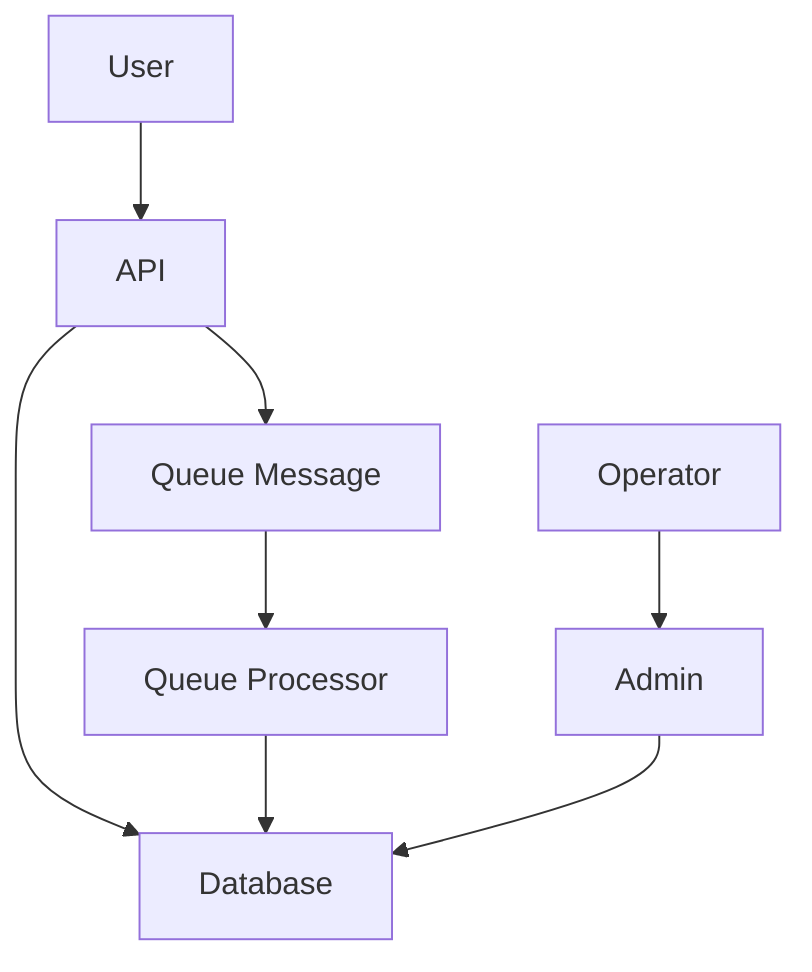
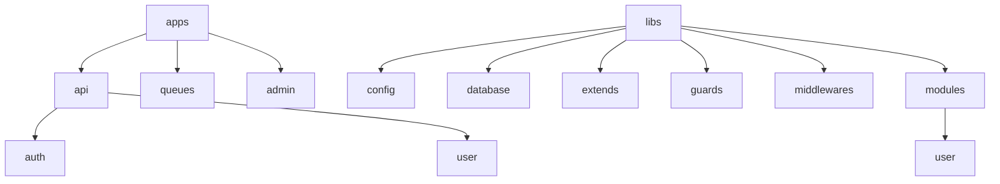

  

<h1 align="center">
The Nest.js Monorepo Boilerplate Starter
</h1>

## Table of Contents

* **[Description](#description)**
  * [Introduction](#introduction)
  * [Architecture](#architecture)
* **[Development](#)**
  * [Installation within docker](docs/installation_within_docker.md).
  * [Installation without docker](docs/installation_without_docker.md).
  * [Usage](docs/usage_development.md).
* **[Deployment](#)**
  * [Build](docs/deployment_on_sun_server.md#cicd)
* **[Integrations](#)**
  * Database: [PostgreSQL](https://www.postgresql.org/about/news/postgresql-14-released-2318/).
  * ORM: [Prisma](https://www.prisma.io/docs)
  * Cache/Messaging: [Redis](https://redis.io/download/#redis).
  * Default is integrated with [OpenAPI](https://github.com/OAI/OpenAPI-Specification).

* **[Stay in touch](#stay-in-touch)**
* **[License](#license)**

## Description

### Introduction

This project is a boilerplate for a monorepo project using [Nestjs](https://nestjs.com/), [Prisma](https://www.prisma.io/), [PostgreSQL](https://www.postgresql.org/), [Redis](https://redis.io/), [OpenAPI](https://github.com/OAI/OpenAPI-Specification)

### Architecture

#### System Overview

The system is divided into 3 main applications:

* **API**: The main API of the system, which is responsible for handling all the requests from the client.
* **Queue**: The queue system of the system, which is responsible for handling all the background tasks.
* **Admin**: The admin system of the system, which is responsible for handling all the requests from the admin.

The flow of the system is as follows:

* The client sends a request to the API.
* The API processes the request and sends a message to the queue. API also CRUD data to the database.
* The queue processor handles the message and save the data to the database and more.
* The admin system can be used to manage the data in the database.

#### Folder Structure

The project is a monorepo project, which means that all the applications are in the same repository. This allows us to share code between the applications and make it easier to manage the applications. I enabled the [Monorepo mode](https://docs.nestjs.com/cli/monorepo#monorepo-mode) of NestJS, which allows us to have multiple applications in the same repository.

The folder structure of the project is as follows:

* Applications:
  * **apps/api**: The source code of the API application.
    * **apps/api/auth**: The source code of the Auth module.
    * **apps/api/user**: The source code of the User module.
  * **apps/queues**: The source code of the Queue application.
  * **apps/admin**: The source code of the Admin application.
* Libs:
  * **libs/config**: The configuration library.
  * **libs/database**: The primary database connection library.
  * **libs/extends**: The library for extending the functionality of the system. Example: library connect to the third-party service such as AWS, Google Cloud, etc.
  * **libs/guards**: The library for the guards of the system.
  * **libs/middlewares**: The library for the middlewares of the system.
  * **libs/modules**: The library for the modules of the system.
    * **libs/modules/user**: The authentication module.

So, i think this is a good structure for a monorepo project. It is easy to manage and easy to share code between the applications.

Example: The `libs/modules/user` library can be used in the API and Admin applications. In API SignUp, API application can be use the `UserModuleLib` to create a new user.

Detail of the folder structure can be found [here](docs/PROJECT_STRUCTURE.md).

#### Nest.js request lifecycle

The request lifecycle of a Nest.js application is as follows:

The detail of the each component can be found [here](https://docs.nestjs.com/first-steps).

## Stay in touch

* :email: Author - [minhhahao@gmail.com](mailto:minhhahao@gmail.com)

## License

[MIT licensed](./LICENSE)
